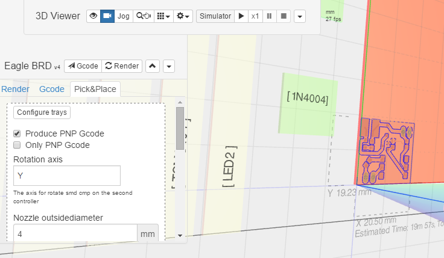

# com-chilipeppr-widget-eagle-pickandplace
This add-on widget is a tab for the Eagle BRD widget that helps you generate gcode for pick and place smd components to a pcb.



## ChiliPeppr Widget Add-On / Pick and Place

All ChiliPeppr widgets/elements are defined using cpdefine() which is a method
that mimics require.js. Each defined object must have a unique ID so it does
not conflict with other ChiliPeppr widgets.

| Item                  | Value           |
| -------------         | ------------- | 
| ID                    | com-chilipeppr-widget-eagle-pickandplace |
| Name                  | Widget Add-On / Pick and Place |
| Description           | This add-on widget is a tab for the Eagle BRD widget that helps you generate gcode for pick and place smd components to a pcb. |
| chilipeppr.load() URL | http://raw.githubusercontent.com/xpix/widget-eagle-pickandplace/master/auto-generated-widget.html |
| Edit URL              | http://ide.c9.io/xpix/widget-eagle-pickandplace |
| Github URL            | http://github.com/xpix/widget-eagle-pickandplace |
| Test URL              | https://preview.c9users.io/xpix/widget-eagle-pickandplace/widget.html |

## Example Code for chilipeppr.load() Statement

You can use the code below as a starting point for instantiating this widget 
inside a workspace or from another widget. The key is that you need to load 
your widget inlined into a div so the DOM can parse your HTML, CSS, and 
Javascript. Then you use cprequire() to find your widget's Javascript and get 
back the instance of it.

```javascript
// Inject new div to contain widget or use an existing div with an ID
$("body").append('<' + 'div id="myDivWidgetEaglePickandplace"><' + '/div>');

chilipeppr.load(
  "#myDivWidgetEaglePickandplace",
  "http://raw.githubusercontent.com/xpix/widget-eagle-pickandplace/master/auto-generated-widget.html",
  function() {
    // Callback after widget loaded into #myDivWidgetEaglePickandplace
    // Now use require.js to get reference to instantiated widget
    cprequire(
      ["inline:com-chilipeppr-widget-eagle-pickandplace"], // the id you gave your widget
      function(myObjWidgetEaglePickandplace) {
        // Callback that is passed reference to the newly loaded widget
        console.log("Widget Add-On / Pick and Place just got loaded.", myObjWidgetEaglePickandplace);
        myObjWidgetEaglePickandplace.init();
      }
    );
  }
);

```

## Publish

This widget/element publishes the following signals. These signals are owned by this widget/element and are published to all objects inside the ChiliPeppr environment that listen to them via the 
chilipeppr.subscribe(signal, callback) method. 
To better understand how ChiliPeppr's subscribe() method works see amplify.js's documentation at http://amplifyjs.com/api/pubsub/

  <table id="com-chilipeppr-elem-pubsubviewer-pub" class="table table-bordered table-striped">
      <thead>
          <tr>
              <th style="">Signal</th>
              <th style="">Description</th>
          </tr>
      </thead>
      <tbody>
      <tr><td colspan="2">(No signals defined in this widget/element)</td></tr>    
      </tbody>
  </table>

## Subscribe

This widget/element subscribes to the following signals. These signals are owned by this widget/element. Other objects inside the ChiliPeppr environment can publish to these signals via the chilipeppr.publish(signal, data) method. 
To better understand how ChiliPeppr's publish() method works see amplify.js's documentation at http://amplifyjs.com/api/pubsub/

  <table id="com-chilipeppr-elem-pubsubviewer-sub" class="table table-bordered table-striped">
      <thead>
          <tr>
              <th style="">Signal</th>
              <th style="">Description</th>
          </tr>
      </thead>
      <tbody>
      <tr><td colspan="2">(No signals defined in this widget/element)</td></tr>    
      </tbody>
  </table>

## Foreign Publish

This widget/element publishes to the following signals that are owned by other objects. 
To better understand how ChiliPeppr's subscribe() method works see amplify.js's documentation at http://amplifyjs.com/api/pubsub/

  <table id="com-chilipeppr-elem-pubsubviewer-foreignpub" class="table table-bordered table-striped">
      <thead>
          <tr>
              <th style="">Signal</th>
              <th style="">Description</th>
          </tr>
      </thead>
      <tbody>
      <tr valign="top"><td>/com-chilipeppr-widget-eagle-pickandplace/com-chilipeppr-widget-3dviewer/request3dObject</td><td>We need to work with the 3D Viewer and inject content, so by sending out this signal the 3D viewer hears it and sends us back a /recv3dObject with the payload.</td></tr>    
      </tbody>
  </table>

## Foreign Subscribe

This widget/element publishes to the following signals that are owned by other objects.
To better understand how ChiliPeppr's publish() method works see amplify.js's documentation at http://amplifyjs.com/api/pubsub/

  <table id="com-chilipeppr-elem-pubsubviewer-foreignsub" class="table table-bordered table-striped">
      <thead>
          <tr>
              <th style="">Signal</th>
              <th style="">Description</th>
          </tr>
      </thead>
      <tbody>
      <tr valign="top"><td>/com-chilipeppr-widget-eagle-pickandplace/com-chilipeppr-widget-eagle/addGcode</td><td>This add-on subscribes to this signal so we can inject our own Gcode into the overall Eagle Widget gcode.</td></tr><tr valign="top"><td>/com-chilipeppr-widget-eagle-pickandplace/com-chilipeppr-widget-3dviewer/recv3dObject</td><td>We need to get the 3D Viewer so we can inject stuff into it. We must subscribe to this so when we call /request3dObject we get this signal back with the payload of the viewer.</td></tr>    
      </tbody>
  </table>

## Methods / Properties

The table below shows, in order, the methods and properties inside the widget/element.

  <table id="com-chilipeppr-elem-methodsprops" class="table table-bordered table-striped">
      <thead>
          <tr>
              <th style="">Method / Property</th>
              <th>Type</th>
              <th style="">Description</th>
          </tr>
      </thead>
      <tbody>
      <tr valign="top"><td>id</td><td>string</td><td>"com-chilipeppr-widget-eagle-pickandplace"<br><br>The ID of the widget. You must define this and make it unique.</td></tr><tr valign="top"><td>name</td><td>string</td><td>"Widget Add-On / Pick and Place"</td></tr><tr valign="top"><td>desc</td><td>string</td><td>"This add-on widget is a tab for the Eagle BRD widget that helps you generate gcode for pick and place smd components to a pcb."</td></tr><tr valign="top"><td>url</td><td>string</td><td>"http://raw.githubusercontent.com/xpix/widget-eagle-pickandplace/master/auto-generated-widget.html"</td></tr><tr valign="top"><td>fiddleurl</td><td>string</td><td>"http://ide.c9.io/xpix/widget-eagle-pickandplace"</td></tr><tr valign="top"><td>githuburl</td><td>string</td><td>"http://github.com/xpix/widget-eagle-pickandplace"</td></tr><tr valign="top"><td>testurl</td><td>string</td><td>"http://widget-eagle-pickandplace-xpix.c9users.io/widget.html"</td></tr><tr valign="top"><td>packages3D</td><td>object</td><td>BETA: Save smd 3d models from https://eagleup.wordpress.com/ in 
sketchup 3d warehouse and use there 3d model viewer at popup for trays
URL Database to my 3dwarehouse gallery, later we save this as json file and load this dynamic
some examples</td></tr><tr valign="top"><td>pnpholders</td><td>object</td><td></td></tr><tr valign="top"><td>rotateAxis</td><td>string</td><td>"Y"</td></tr><tr valign="top"><td>nozzleDiameter</td><td>number</td><td></td></tr><tr valign="top"><td>safetyHeight</td><td>number</td><td></td></tr><tr valign="top"><td>holderCoordinates</td><td>object</td><td></td></tr><tr valign="top"><td>components</td><td>object</td><td></td></tr><tr valign="top"><td>packagesTrays</td><td>object</td><td></td></tr><tr valign="top"><td>packagesPockets</td><td>object</td><td></td></tr><tr valign="top"><td>publish</td><td>object</td><td>Please see docs above.<br><br>Define the publish signals that this widget/element owns or defines so that
other widgets know how to subscribe to them and what they do.</td></tr><tr valign="top"><td>subscribe</td><td>object</td><td>Please see docs above.<br><br>Define the subscribe signals that this widget/element owns or defines so that
other widgets know how to subscribe to them and what they do.</td></tr><tr valign="top"><td>foreignPublish</td><td>object</td><td>Please see docs above.<br><br>Document the foreign publish signals, i.e. signals owned by other widgets
or elements, that this widget/element publishes to.</td></tr><tr valign="top"><td>foreignSubscribe</td><td>object</td><td>Please see docs above.<br><br>Document the foreign subscribe signals, i.e. signals owned by other widgets
or elements, that this widget/element subscribes to.</td></tr><tr valign="top"><td>eagleWidget</td><td>object</td><td>Holds the reference to the main Eagle Widget that we are an add-on for.</td></tr><tr valign="top"><td>init</td><td>function</td><td>function (eagleWidget) <br><br>All widgets should have an init method. It should be run by the
instantiating code like a workspace or a different widget.</td></tr><tr valign="top"><td>injectTab</td><td>function</td><td>function () <br><br>Inject the solder mask tab into the Eagle Brd Widget</td></tr><tr valign="top"><td>isTabShowing</td><td>boolean</td><td></td></tr><tr valign="top"><td>pnp3d</td><td>object</td><td>Holds the pnp 3d object that we show in the 3D viewer.</td></tr><tr valign="top"><td>started</td><td>function</td><td>function ()<br><br>widget to know if startet or not.</td></tr><tr valign="top"><td>onTabShown</td><td>function</td><td>function () <br><br>When the user clicks to activate our tab, this event is called.</td></tr><tr valign="top"><td>onTabHide</td><td>function</td><td>function () <br><br>When the user clicks a different tab and this one gets hidden.</td></tr><tr valign="top"><td>onMouseOverCallback</td><td>function</td><td>function (event, object) <br><br>When the user move mouse over pocket or tray then display additional info's.</td></tr><tr valign="top"><td>drawpickandplace</td><td>function</td><td>function () <br><br>Iterate through the Eagle BRD dimensions XY coordinates and draw
a solder mask over the board.</td></tr><tr valign="top"><td>drawPCBHolder</td><td>function</td><td>function ()</td></tr><tr valign="top"><td>drawTraysandPockets</td><td>function</td><td>function ()</td></tr><tr valign="top"><td>drawPlatform</td><td>function</td><td>function ()</td></tr><tr valign="top"><td>drawBox</td><td>function</td><td>function (blength, bwidth) </td></tr><tr valign="top"><td>subscribeToAddGcodeSignal</td><td>function</td><td>function () <br><br>We subscribe to the main Eagle Widget's addGcode publish signal
so that we can inject our own Gcode to the main widget.</td></tr><tr valign="top"><td>subscribeToBeforeRender</td><td>function</td><td>function () <br><br>We subscribe to the main Eagle Widget's addGcode publish signal
so that we can inject our own Gcode to the main widget.</td></tr><tr valign="top"><td>onAddGcode</td><td>function</td><td>function (addGcodeCallback, gcodeParts, eagleWidget, helpDesc)<br><br>This is our callback that gets called when the /com-chilipeppr-widget-eagle/addGcode
signal is published by the main Eagle Widget. This is where we get to actually
inject our own Gcode to the final overall Gcode.</td></tr><tr valign="top"><td>onBeforeRender</td><td>function</td><td>function (self)<br><br>After Render Register all components and sort to the trays and pockets</td></tr><tr valign="top"><td>setupComponentsTable</td><td>function</td><td>function ()<br><br>Display table with all components sortet to the trays and pockets.</td></tr><tr valign="top"><td>registerEagleComponents</td><td>function</td><td>function (self)<br><br>Read all eagle components and decide for try or pocket or ignore.</td></tr><tr valign="top"><td>sortTrayComponents</td><td>function</td><td>function ()<br><br>Sort all components to trays for the shortest move between tray and component place.</td></tr><tr valign="top"><td>sortPocketComponents</td><td>function</td><td>function ()<br><br>Sort all components to pockets for the shortest move between pocket and component place.</td></tr><tr valign="top"><td>selectbox</td><td>function</td><td>function (id, hash, outcallback, selected)<br><br>empty and fill html select box</td></tr><tr valign="top"><td>table</td><td>function</td><td>function (id, array)<br><br>empty and fill html table</td></tr><tr valign="top"><td>exportGcodepickandplace</td><td>function</td><td>function (eagleWidget) <br><br>Generate the gcode for pnp</td></tr><tr valign="top"><td>rotateStrategy</td><td>function</td><td>function (cmp)</td></tr><tr valign="top"><td>putStrategy</td><td>function</td><td>function (cmp)<br><br>Strategy in gcode to put a cmp to pcb.</td></tr><tr valign="top"><td>size</td><td>function</td><td>function (cmp)<br><br>return width and height from cmp.</td></tr><tr valign="top"><td>pocketStrategy</td><td>function</td><td>function (cmp, pocketname)<br><br>return gcode to get cmp from pocket.</td></tr><tr valign="top"><td>tapeStrategy</td><td>function</td><td>function (cmp, trayname)<br><br>return gcode to get cmp from tape.</td></tr><tr valign="top"><td>get3dObj</td><td>function</td><td>function (callback) <br><br>return 3dobject from 3dviewer.</td></tr><tr valign="top"><td>get3dObjCallback</td><td>function</td><td>function (data, meta) </td></tr><tr valign="top"><td>mySceneGroup</td><td>object</td><td></td></tr><tr valign="top"><td>sceneAdd</td><td>function</td><td>function (obj) </td></tr><tr valign="top"><td>sceneRemove</td><td>function</td><td>function (obj) </td></tr><tr valign="top"><td>rotateObject</td><td>function</td><td>function (object, degrees)</td></tr><tr valign="top"><td>options</td><td>object</td><td>User options are available in this property for reference by your
methods. If any change is made on these options, please call
saveOptionsLocalStorage()</td></tr><tr valign="top"><td>setupUiFromLocalStorage</td><td>function</td><td>function () <br><br>Call this method on init to setup the UI by reading the user's
stored settings from localStorage and then adjust the UI to reflect
what the user wants.</td></tr><tr valign="top"><td>reginput</td><td>function</td><td>function (field)<br><br>Register input field as change event and as entry in this.options.
also recognize loaded data from localspace (options)</td></tr><tr valign="top"><td>setValue</td><td>function</td><td>function (value)</td></tr><tr valign="top"><td>getValue</td><td>function</td><td>function (value, entry)</td></tr><tr valign="top"><td>saveOptionsLocalStorage</td><td>function</td><td>function () <br><br>When a user changes a value that is stored as an option setting, you
should call this method immediately so that on next load the value
is correctly set.</td></tr><tr valign="top"><td>forkSetup</td><td>function</td><td>function () <br><br>This method loads the pubsubviewer widget which attaches to our 
upper right corner triangle menu and generates 3 menu items like
Pubsub Viewer, View Standalone, and Fork Widget. It also enables
the modal dialog that shows the documentation for this widget.<br><br>By using chilipeppr.load() we can ensure that the pubsubviewer widget
is only loaded and inlined once into the final ChiliPeppr workspace.
We are given back a reference to the instantiated singleton so its
not instantiated more than once. Then we call it's attachTo method
which creates the full pulldown menu for us and attaches the click
events.</td></tr><tr valign="top"><td>getObjects</td><td>function</td><td>function (hash)</td></tr><tr valign="top"><td>hash2array</td><td>function</td><td>function (hash)</td></tr><tr valign="top"><td>searchObj</td><td>function</td><td>function (obj, path, search)</td></tr>
      </tbody>
  </table>


## About ChiliPeppr

[ChiliPeppr](http://chilipeppr.com) is a hardware fiddle, meaning it is a 
website that lets you easily
create a workspace to fiddle with your hardware from software. ChiliPeppr provides
a [Serial Port JSON Server](https://github.com/johnlauer/serial-port-json-server) 
that you run locally on your computer, or remotely on another computer, to connect to 
the serial port of your hardware like an Arduino or other microcontroller.

You then create a workspace at ChiliPeppr.com that connects to your hardware 
by starting from scratch or forking somebody else's
workspace that is close to what you are after. Then you write widgets in
Javascript that interact with your hardware by forking the base template 
widget or forking another widget that
is similar to what you are trying to build.

ChiliPeppr is massively capable such that the workspaces for 
[TinyG](http://chilipeppr.com/tinyg) and [Grbl](http://chilipeppr.com/grbl) CNC 
controllers have become full-fledged CNC machine management software used by
tens of thousands.

ChiliPeppr has inspired many people in the hardware/software world to use the
browser and Javascript as the foundation for interacting with hardware. The
Arduino team in Italy caught wind of ChiliPeppr and now
ChiliPeppr's Serial Port JSON Server is the basis for the 
[Arduino's new web IDE](https://create.arduino.cc/). If the Arduino team is excited about building on top
of ChiliPeppr, what
will you build on top of it?

